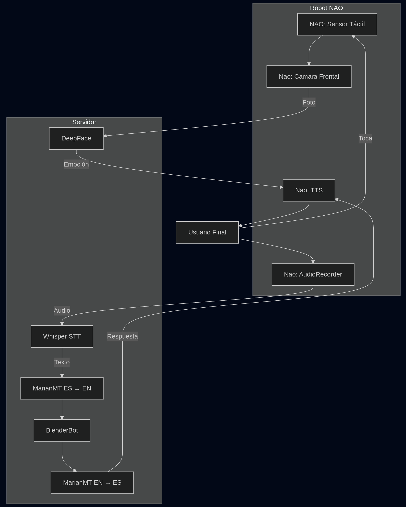
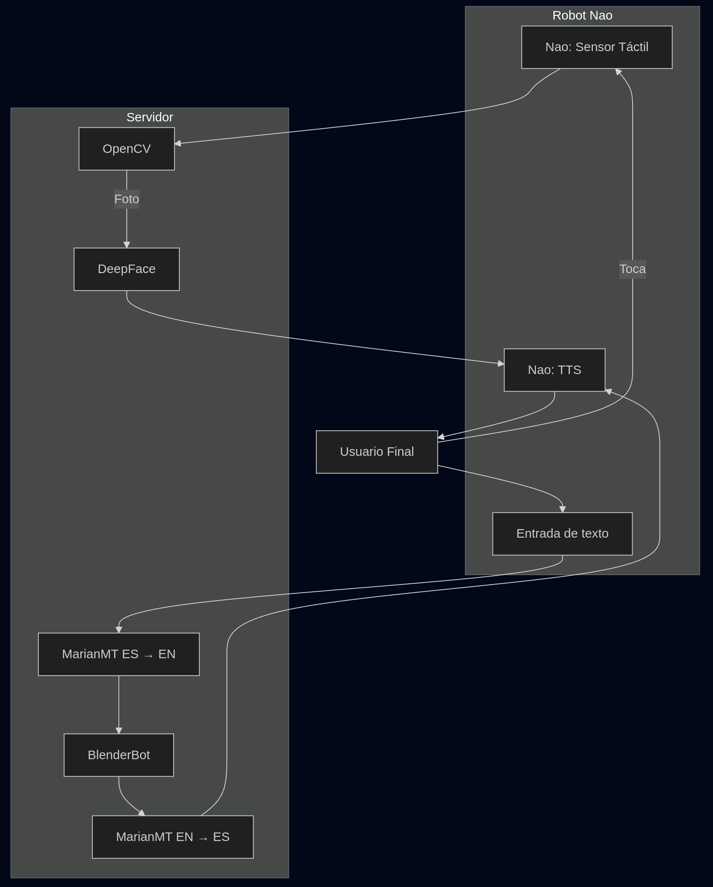

# Proyecto de Interacción Usuario-Robot NAO

Este proyecto tiene como objetivo establecer una interacción entre un usuario y el robot NAO mediante una conversación. A través de un sensor en la cabeza del robot, se captura una foto del usuario que es analizada para detectar la emoción dominante. Luego, el robot genera respuestas para mantener una conversación en español con el usuario.

**Link del video:** https://youtu.be/KjfTThC-QmY

## Descripción

1. **Interacción Inicial**: El usuario inicia la interacción tocando el sensor en la cabeza del robot.
2. **Captura y Análisis de Imagen**: Una vez tocado el sensor, el robot toma una foto del usuario mediante la cámara web del dispositivo que lo controla. Luego, se realiza un análisis de emociones en la imagen.
3. **Iniciación de Conversación**: Dependiendo de la emoción dominante detectada, el robot inicia una conversación preguntando cómo se siente el usuario.
4. **Respuestas del Usuario**: El usuario responde mediante texto, y el robot continuará la conversación hasta que el usuario indique "DETENER".
5. **Esperar nueva interacción**: Nao queda atento a un nuevo toque a la cabeza.

## Limitaciones

- **Captura de imagen**: La captura de la imagen original con la cámara del robot NAO fue descartada debido a restricciones de seguridad. Se optó por usar la cámara web del dispositivo.
- **Modelo de chatbot pequeño**: El modelo escogido fue uno pequeño por lo que tiene problemas al retener memoria y dar buenas respuestas.
- **Reconocimiento de voz**: El sistema de reconocimiento de voz del robot NAO solo reconoce comandos predefinidos, lo que limitaba la libertad del usuario para expresarse. Por lo tanto, la interacción se realiza a través de texto en lugar de audio.

## Diagrama de Componentes
### Idea Inicial

### Diagrama Final

---

## Requisitos de Instalación

### 1. **Entorno de Desarrollo**

- **Visual Studio Code** o cualquier otro entorno que permita manejar dos versiones de Python simultáneamente.

### 2. **Instalar Choregraphe**

Choregraphe es necesario para simular el movimiento y las acciones del robot NAO.

- [Descargar Choregraphe](https://drive.google.com/file/d/1fJHgV-SHTfVJ_lM82l8ei6bFOo7mlqRH/view?usp=sharing)

Una vez descargado, cambia las preferencias de Choregraphe para que simule el robot NAO H25 (V6). Asegúrate de que el puerto de conexión esté correctamente configurado.

### 3. **Instalar Python 2.7.16**

El robot NAO funciona con Python 2.7.16, por lo que necesitas instalar esa versión específica.

- [Descargar Python 2.7.16](https://www.python.org/downloads/release/python-2716/)

### 4. **Instalar PYNAOQI 2.1.4.13**

Este software es necesario para controlar el robot NAO mediante comandos de Python 2.7.16.

- [Descargar PYNAOQI 2.1.4.13](https://drive.google.com/drive/folders/1qV5SQoCFunSMaVyAQVcsozLhM4F6K4zx)

---

## Instalación de Librerías

### Python 3.12.6 (Servidor)

El código en Python 3.12.6 se encarga del análisis de emociones y generación de respuestas, además de establecer un servidor Flask para la comunicación entre los dos intérpretes de Python.

1. **Flask**:
   `pip install Flask`
   
   Para crear un servidor localmente.

2. **DeepFace**:
   `pip install deepface`

   Modelo pre entrenado para detectar emociones en imágenes.
   
3. **Hugging Face transformers**:
   `pip install transformers`
   
   Transformers de HuggingFace almacena muchos modelos pre entrenados, de los cuales nos interesan:
   - BlenderbotTokenizer: Es un modelo para tokenizar textos para modelos BlenderBot (de Facebook).
   - BlenderbotForConditionalGeneration: Modelo para generar textos en forma de diálogos usando Blenderbot.
   - MarianMTModel: Los diálogos de BlenderBot (chatbot) se generan en inglés, por lo que se utiliza un modelo de traducción automática para convertir entre español e inglés, permitiendo que la conversación con el robot se mantenga en español.
   - MarianTokenizer: Este modelo se encarga de pre procesar el texto para que MarianMTModel pueda entenderlo y realizar la traducción entre idiomas.

   
5. **sentencepiece**:
   `pip install sentencepiece`

   Librería necesaria para que MarianMTModel trabaje con la data de entrenamiento Helsinki.
   
6. **Otras librerías necesarias**:
   `pip install opencv-python numpy torch`

### Python 2.7.16 (NAO Cliente)

El código en Python 2.7.16 controla directamente al robot NAO utilizando la librería PYNAOQI y manda las solicitudes al servidor. 

1. **Requests**:
   `python2.7 -m pip install requests`
   
   Permite el envío de solicitudes para conectarse al servidor.

2. **Configurar las variables**:

   - IP: Dirección IP del robot NAO.
   - PROXY: Número del puerto de conexión con el robot NAO.   
